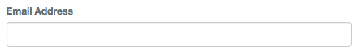
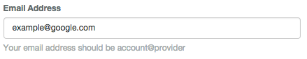
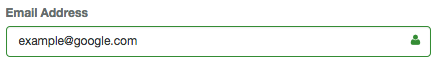
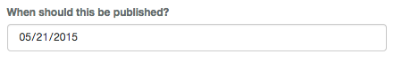
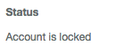
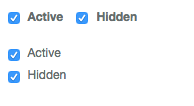

Form
=======

Sizes and Types
---------------
The bootstrap form builder has a few things that it considers globally important to a form.

Sizes can be looked at as the gutters everything will fall into.  By default, we assume a label will be 2 columns and
the inputs will be 10 columns.  This can be changed using setSizes() at any time.

.. note:: Sizes only apply to horizontal type forms.

Type describes the bootstrap form type.  A type can be basic, inline or horizontal.  You can see details on the types at
`getbootstrap.com <http://getbootstrap.com/css/#forms>`_.

Form Groups
-----------
To use bootstrap form groups is actually pretty easy.::

    {{ Form::groupOpen() }}
        // Form elements
    {{ Form::groupClose() }}

To make things easier, when calling groupOpen() you can pass up to 3 sizes and it will reset the sizes for this group.
The form will switch back to the previous sizes once the form group is closed.

Form groups have a few optional addendums that you can use to better control the output.

Sizing
~~~~~~~
You can add ``lg`` or ``sm`` to change the input sizes of the form group elements.

.. code:: HTML

    {{ Form::lgGroupOpen() }}

Offset Inputs
~~~~~~~~~~~~
For checkboxes, radios and submit buttons, you may not have any labels on the left (primarily on horizontal forms).  For
these situations, open an offset form group.

.. code:: HTML

    {{ Form::offsetGroupOpen() }}

Validation States
~~~~~~~~~~~~~~~~~
Bootstrap also gives nice validation states to form groups.  These are success, warning and error.

.. code:: HTML

    {{ Form::warningGroupOpen() }}

Feedback
~~~~~~~~
Lastly, form inputs can have icons denoting feedback.  These too require a special form group.

.. code:: HTML

    {{ Form::feedbackGroupOpen() }}

Putting it all together
~~~~~~~~~~~~~~~~~~~~~~~
The bst thing of all is that these groups are not exclusive.  You can combine them as you wish to get any result you need.

.. code:: HTML

    {{ Form::warningFeedbackGroupOpen() }}
    {{ Form::errorOffsetLgGroupOpen() }}

Inputs
-------
Now that we can open form groups, let's dig into inputs.  These are the basis of all forms, so they deserve attention.

Each form element that is called automatically gets the class ``form-control`` added to it.  Certain specific elements get
default classes added to them as well but will be covered in their own area below.

label
~~~~~~~
This element will have the ``sr-only`` class applied to it on inline forms and ``col-md-<label size> control-label`` for
horizontal forms.

.. note:: Be careful with this.  If you call this and also set the label parameter on your input, two labels will show up.

============ ======== ========== =========================================
Parameters   Required Default    Notes
============ ======== ========== =========================================
$name        Yes                 The name of the element this label is for.
$value       No       null       The text displayed for the label.
$options     No       []         Any attributes to add to the element.
============ ======== ========== =========================================

Code
^^^^^^^
.. code:: HTML

    {{ Form::label('email', 'Email Address') }}
    {{ Form::text('email') }}

HTML
^^^^^^^^^^^
.. code:: HTML

    

        <label for="email">Email Address</label>
        <input class="form-control" name="email" type="text" id="email">
    

Output
^^^^^^^

help
~~~~~~~
The help method will add help text to a given element.

============ ======== ========== =========================================
Parameters   Required Default    Notes
============ ======== ========== =========================================
$text        Yes                 The text that will be displayed.
$options     No       []         Any attributes to add to the element.
============ ======== ========== =========================================

Code
^^^^^^^
.. code:: HTML

    {{ Form::text('email', $user->email, [], 'Email Address') }}
    {{ Form::help('Your email address should be account@provider') }}

HTML
^^^^^^^^^^^
.. code:: HTML

    

        <label for="email">Email Address</label>
        <input class="form-control" name="email" type="text" value="example@google.com" id="email">
        Your email address should be account@provider
    

Output
^^^^^^^

icon
~~~~~~~
This is used in conjunction with the feedback form group.  It is what sets the icon inside of the input element.

============ ======== ========== =========================================
Parameters   Required Default    Notes
============ ======== ========== =========================================
$class       Yes                 The class(es) of the icon to use.
$options     No       []         Any attributes to add to the element.
============ ======== ========== =========================================

.. note:: The form builder will take into account glyphicon and font-awesome classes for spacing.

Code
^^^^^^^
.. code:: HTML

    {{ Form::feedbackSuccessGroupOpen() }}
        {{ Form::text('email', $user->email, [], 'Email Address') }}
        {{ Form::icon('fa fa-user') }}
    {{ Form::groupClose() }}

HTML
^^^^^^^^^^^
.. code:: HTML

    

        <label for="email">Email Address</label>
        <input class="form-control has-success has-feedback" name="email" type="text" value="example@google.com" id="email">
        
    

Output
^^^^^^^

date
~~~~~~~
This will create a standard HTML 5 date input.

============ ======== ========== =========================================
Parameters   Required Default    Notes
============ ======== ========== =========================================
$name        Yes                 The name of the element this label is for.
$value       No       null       The text displayed for the label.
$options     No       []         Any attributes to add to the element.
$label       No       null       Is this is supplied, it creates a label with this text for you.
============ ======== ========== =========================================

Code
^^^^^^^
.. code:: HTML

    {{ Form::date('publish_on', '2015-05-21', [], 'When should this be published?') }}

HTML
^^^^^^^^^^^
.. code:: HTML

    

        <label for="publish_on">When should this be published?</label>
        <input class="form-control" name="publish_on" type="date" value="2015-05-21">
    

Output
^^^^^^^

staticInput
~~~~~~~
This will create a text entry instead of an input element.  See
`getbootstrap.com <http://getbootstrap.com/css/#forms-controls-static>`_ for more details.

============ ======== ========== =========================================
Parameters   Required Default    Notes
============ ======== ========== =========================================
$name        Yes                 The name of the element this label is for.
$value       No       null       The text displayed for the label.
$options     No       []         Any attributes to add to the element.
$label       No       null       Is this is supplied, it creates a label with this text for you.
============ ======== ========== =========================================

Code
^^^^^^^
.. code:: HTML

    {{ Form::staticInput('Account is locked', [], 'Status') }}

HTML
^^^^^^^^^^^
.. code:: HTML

    

        <label for="">Status</label>
        
Account is locked

    

Output
^^^^^^^

checkbox and radio
~~~~~~~
These are unique but similar to each other, so they will be tackled together.

============ ======== ========== =========================================
Parameters   Required Default    Notes
============ ======== ========== =========================================
$name        Yes                 The name of the element this label is for.
$value       No       null       The text displayed for the label.
$checked     No       false      Wether the element should be checked by default.
$options     No       []         Any attributes to add to the element.
$label       No       null       Is this is supplied, it creates a label with this text for you.
$inline      No       false      This switched the elements to be inline instead of stacked.
============ ======== ========== =========================================

Code
^^^^^^^
.. code:: HTML

    {{ Form::offsetGroupOpen() }}
        {{ Form::checkbox('active', 1, true, [], 'Active', true) }}
        {{ Form::checkbox('hidden', 1, true, [], 'Hidden', true) }}
    {{ Form::groupClose() }}
    {{ Form::offsetGroupOpen() }}
        {{ Form::checkbox('active', 1, true, [], 'Active') }}
        {{ Form::checkbox('hidden', 1, true, [], 'Hidden') }}
    {{ Form::groupClose() }}

HTML
^^^^^^^^^^^
.. code:: HTML

    

		

			<label><input checked="checked" name="active" type="checkbox" value="1"> Active</label>
		

		

			<label><input checked="checked" name="hidden" type="checkbox" value="1"> Hidden</label>
		

    

    

		

			<label><input checked="checked" name="active" type="checkbox" value="1"> Active</label>
		

		

			<label><input checked="checked" name="hidden" type="checkbox" value="1"> Hidden</label>
		

    

Output
^^^^^^^

Everything else
~~~~~~~~~~~~~~~
Each other input is the same as ``illuminate/html`` defaults with the addition of a final parameter: $label.  You can add
this to quickly create a label for any input you are using.

Code
^^^^^^^
.. code:: HTML

    {{ Form::text(name, value, options, 'Some Label') }}

HTML
^^^^^^^^^^^
.. code:: HTML

    

        <label for="email">Email Address</label>
        <input class="form-control has-success has-feedback" name="email" type="text" value="example@google.com" id="email">
        
    

Output
^^^^^^^

Helpers
-------
open
~~~~~~~
The open method is pretty much the same as Laravel default but with an optional second parameter.  This allows you to set
the form type when opening the form.  It also makes sure your form has the correct bootstrap class based on the type you
chose.

============ ======== ========== =========================================
Parameters   Required Default    Notes
============ ======== ========== =========================================
$options     No       []         Any options to pass to the form.
$type        No       horizontal The form type (basic, inline or horizontal).
============ ======== ========== =========================================

.. code:: HTML

    {{ Form::open([], 'inline') }}

setSizes
~~~~~~~~
This is used to set the sizes for the entire form.  Use it before opening the form.  If only the first parameter is sent,
the second size will be 12 minus the first (to allow for a full bootstrap column set).

============ ======== ================= =========================================
Parameters   Required Default           Notes
============ ======== ================= =========================================
$labelSize   Yes                        The size for labels (left most column).
$column1   No       12 - ($labelSize) The size for the inputs (center or right column).
$column2    No       0                 An optional third column for anything extra (right column).
============ ======== ================= =========================================

.. code:: HTML

    {{ Form::setSizes(4, 6)->open() }}

setType
~~~~~~~
This is used to set the type manually (outside of the ``open()`` method).  This too must be called before opening the form.

============ ======== ========== =========================================
Parameters   Required Default    Notes
============ ======== ========== =========================================
$type        No                  The type to set the form to.  (basic, inline or horizontal).
============ ======== ========== =========================================

.. code:: HTML

    {{ Form::setType('basic')->open() }}

To-Do
-------
- input groups