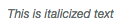

HTML
====================

Image Links
-----------

linkImage
~~~~~~~~~
=========== ======== ======= =========================================
Parameters  Required Default Notes
=========== ======== ======= =========================================
$url        Yes              The url the image will link to.
$imageSrc   Yes              The location of the image.
$attributes No       []      Any attributes to add to the anchor tag.
$https      No       null    Whether to use https.
=========== ======== ======= =========================================

.. code:: HTML

    {{ HTML::linkImage('/home', public_path('img/test.png')) }}

linkRouteImage
~~~~~~~~~~~~~~
=========== ======== ======= =========================================
Parameters  Required Default Notes
=========== ======== ======= =========================================
$route      Yes              The route the image will link to.
$parameters Yes              Any parameters the route may need.
$imageSrc   Yes              The location of the image.
$attributes No       []      Any attributes to add to the anchor tag.
$https      No       null    Whether to use https.
=========== ======== ======= =========================================

.. code:: HTML

    {{ HTML::linkRouteImage('user.profile', ['id' => 1], public_path('img/test.png')) }}

Icon Links
----------

linkIcon
~~~~~~~~
============ ======== ======= =========================================
Parameters   Required Default Notes
============ ======== ======= =========================================
$url         Yes              The url the image will link to.
$iconClasses Yes              The icon classes to use.
$iconText    No       null    Any text to display after the icon.
$attributes  No       []      Any attributes to add to the anchor tag.
$https       No       null    Whether to use https.
============ ======== ======= =========================================

.. code:: HTML

    {{ HTML::linkIcon('/home', 'fa fa-home', 'Go Home') }}

linkRouteIcon
~~~~~~~~~~~~~~
============ ======== ======= =========================================
Parameters   Required Default Notes
============ ======== ======= =========================================
$route       Yes              The route the image will link to.
$parameters  Yes              Any parameters the route may need.
$iconClasses Yes              The icon classes to use.
$iconText    No       null    Any text to display after the icon.
$attributes  No       []      Any attributes to add to the anchor tag.
$https       No       null    Whether to use https.
============ ======== ======= =========================================

.. code:: HTML

    {{ HTML::linkRouteIcon('user.profile', ['id' => 1], 'fa fa-user', 'Admin's Profile') }}

Typography
----------
span
~~~~~~~
============ ======== ======= =========================================
Parameters   Required Default Notes
============ ======== ======= =========================================
$value       Yes              The text inside the tag.
$attributes  No       []      Any attributes to add to the tag.
============ ======== ======= =========================================

Code
^^^^^^^^
.. code:: HTML

    {{ HTML::span('this is a span') }}

Output
^^^^^^^

bold
~~~~~~~
============ ======== ======= =========================================
Parameters   Required Default Notes
============ ======== ======= =========================================
$value       Yes              The text inside the tag.
$attributes  No       []      Any attributes to add to the tag.
============ ======== ======= =========================================

Code
^^^^^^^^
.. code:: HTML

    {{ HTML::bold('This is bold text') }}

Output
^^^^^^^

italic
~~~~~~~
============ ======== ======= =========================================
Parameters   Required Default Notes
============ ======== ======= =========================================
$value       Yes              The text inside the tag.
$attributes  No       []      Any attributes to add to the tag.
============ ======== ======= =========================================

Code
^^^^^^^^
.. code:: HTML

    {{ HTML::italic('This is italicized text') }}

Output
^^^^^^^

delete
~~~~~~~
============ ======== ======= =========================================
Parameters   Required Default Notes
============ ======== ======= =========================================
$value       Yes              The text inside the tag.
$attributes  No       []      Any attributes to add to the tag.
============ ======== ======= =========================================

Code
^^^^^^^^
.. code:: HTML

    {{ HTML::delete('This is deleted text') }}

Output
^^^^^^^

strike
~~~~~~~
============ ======== ======= =========================================
Parameters   Required Default Notes
============ ======== ======= =========================================
$value       Yes              The text inside the tag.
$attributes  No       []      Any attributes to add to the tag.
============ ======== ======= =========================================

Code
^^^^^^^^
.. code:: HTML

    {{ HTML::strike('This text is striked out') }}

Output
^^^^^^^
.. image:: images/html/strike.png

insert
~~~~~~~
============ ======== ======= =========================================
Parameters   Required Default Notes
============ ======== ======= =========================================
$value       Yes              The text inside the tag.
$attributes  No       []      Any attributes to add to the tag.
============ ======== ======= =========================================

Code
^^^^^^^^
.. code:: HTML

    {{ HTML::insert('This is inserted text') }}

Output
^^^^^^^

underline
~~~~~~~
============ ======== ======= =========================================
Parameters   Required Default Notes
============ ======== ======= =========================================
$value       Yes              The text inside the tag.
$attributes  No       []      Any attributes to add to the tag.
============ ======== ======= =========================================

Code
^^^^^^^^
.. code:: HTML

    {{ HTML::underline('This is underlined text') }}

Output
^^^^^^^

mark
~~~~~~~
============ ======== ======= =========================================
Parameters   Required Default Notes
============ ======== ======= =========================================
$value       Yes              The text inside the tag.
$attributes  No       []      Any attributes to add to the tag.
============ ======== ======= =========================================

Code
^^^^^^^^
.. code:: HTML

    This is {{ HTML::mark('marked') }} text

Output
^^^^^^^

small
~~~~~~~
============ ======== ======= =========================================
Parameters   Required Default Notes
============ ======== ======= =========================================
$value       Yes              The text inside the tag.
$attributes  No       []      Any attributes to add to the tag.
============ ======== ======= =========================================

Code
^^^^^^^^
.. code:: HTML

    This is {{ HTML::small('small') }} text

Output
^^^^^^^

lead
~~~~~~~
============ ======== ======= =========================================
Parameters   Required Default Notes
============ ======== ======= =========================================
$value       Yes              The text inside the tag.
============ ======== ======= =========================================

Code
^^^^^^^^
.. code:: HTML

    {{ HTML::lead('This text should stand out.') }}

Output
^^^^^^^

quote
~~~~~~~
============ ======== ======= =========================================
Parameters   Required Default Notes
============ ======== ======= =========================================
$value       Yes              The text inside the tag.
$source      No       null    The source of the quote.
============ ======== ======= =========================================

Code
^^^^^^^^
.. code:: HTML

    {{ HTML::quote('This is quoted text.', 'By Stygian') }}

Output
^^^^^^^

description
~~~~~~~~~~~
To use bootstrap description lists pass an array to this method.  The key will be the bolded text, the value will be the
description text.

============ ======== ======= =========================================
Parameters   Required Default Notes
============ ======== ======= =========================================
$list        Yes              The text inside the tag.
$attributes  No       []      Any attributes to add to the tag.
============ ======== ======= =========================================

Code
^^^^^^^^
.. code:: HTML

    $list = ['Description lists' => 'A description list is perfect for defining terms.', 'Euismod' => 'something'];

    {{ HTML::description($list) }}
    {{ HTML::description($list, ['class' => 'dl-horizontal']) }}

Output
^^^^^^^

Code
----------

code
~~~~~~~
============ ======== ======= =========================================
Parameters   Required Default Notes
============ ======== ======= =========================================
$value       Yes              The text inside the tag.
$attributes  No       []      Any attributes to add to the tag.
============ ======== ======= =========================================

Code
^^^^^^^^
.. code:: HTML

    This is {{ HTML::code('code') }} text

Output
^^^^^^^

kbd
~~~~~~~
KBD can accept either a single key or an array of keys.  If it gets an array, it will automatically place the ``+`` between
them.

============ ======== ======= =========================================
Parameters   Required Default Notes
============ ======== ======= =========================================
$keys        Yes              The keyboard key(S) that will be used.
============ ======== ======= =========================================

Code
^^^^^^^^
.. code:: HTML

    {{ HTML::kbd('ctrl') }}
    {{ HTML::kbd(['ctrl', 'alt', 'del']) }}

Output
^^^^^^^

Iframes
----------

iframe
~~~~~~~
This will create a generic iframe with whatever you pass to it.

============ ======== ======= =========================================
Parameters   Required Default Notes
============ ======== ======= =========================================
$url         Yes              The url the iframe will point to.
$attributes  No       []      Any attributes to add to the tag.
============ ======== ======= =========================================

Code
^^^^^^^^
.. code:: HTML

    {{ HTML::iframe('http://google.com') }}

embed
~~~~~~~
This will create a bootstrap iframe that uses responsive sizing.

============ ======== ======= =========================================
Parameters   Required Default Notes
============ ======== ======= =========================================
$url         Yes              The url the iframe will point to.
$aspect      No       16by9   Valid aspects are 16by9 and 4by3.
============ ======== ======= =========================================

Code
^^^^^^^^
.. code:: HTML

    {{ HTML::embed('http://google.com', '4by3') }}

