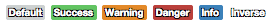
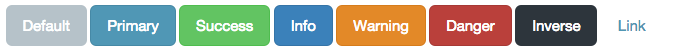
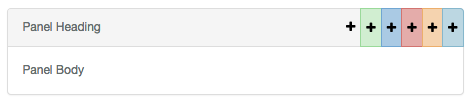

New CSS Classes
============

Backgrounds
-----------
A number of background colors have been supplied.  These can be added to any element as they just set the background
color to the themes predefined colors.

============ ================
Class        Brand color
============ ================
bg-primary   brand-primary
bg-info      brand-info
bg-warning   brand-warning
bg-danger    brand-danger
bg-success   brand-success
bg-inverse   brand-black
bg-purple    brand-purple
bg-radiation brand-radiation
============ ================

Badges
------
There are a few new badge classes.  These work the same as standard classes and use the corresponding brand color for
their background color.

- badge-primary
- badge-info
- badge-success
- badge-warning
- badge-danger

Code
~~~~~~~
.. code:: HTML

    10

Output
~~~~~~~~

Buttons
-------
This is meant to be an inverted button.  It varies by theme, but will always match the default theme settings.

- btn-inverse

Code
~~~~~~~
.. code:: HTML

    <button class="btn btn-inverse">Go Back</button>

Output
~~~~~~~~

Panels
-------
We have worked to add quite a few useful additions to panels.  These are all completely optional of course, but we feel
they add a lot of functionality people would find useful.

Panel Alerts
~~~~~~~~~~~~
Panel alerts are used when you need to alert the user to some details about what the panel contains.  You could also use
them to detail errors and messages from form submission if you chose as well.

Code
^^^^^^^
.. code:: HTML

    

        
Info Alert

    

Output
^^^^^^^
===================== ========================
Class                 Image
===================== ========================
panel-alert-info      .. image:: images/css/panel-alert-info.png
                        :width: 75%
panel-alert-warning   .. image:: images/css/panel-alert-warning.png
                        :width: 75%
panel-alert-danger    .. image:: images/css/panel-alert-danger.png
                        :width: 75%
panel-alert-success   .. image:: images/css/panel-alert-success.png
                        :width: 75%
===================== ========================

Panel Buttons
~~~~~~~~~~~~~
Panel buttons are used to add quick and easy buttons to the panel heading.  These come in all the common classes or a
classless version.

You can have as many or as few as you want.  Just keep adding them to suit your needs.

Code
^^^^^^^
.. code:: HTML

    

        

            Panel Heading
            

                <a><i class="fa fa-plus"></i></a>
            

        

        
Panel Body

    

Output
^^^^^^^
===================== ========================
Class                 Image
===================== ========================
primary               .. image:: images/css/panel-button-primary.png
info                  .. image:: images/css/panel-button-info.png
warning               .. image:: images/css/panel-button-warning.png
danger                .. image:: images/css/panel-button-danger.png
success               .. image:: images/css/panel-button-success.png
<none>                .. image:: images/css/panel-button-none.png
===================== ========================

Text
-------
The only addition to text is the inclusion of text-primary as a class.  This will set your text color to the brand-primary.

Code
^^^^^^^
.. code:: HTML

    
Something

Tables
-------
The only addition to tables is the inclusion of a primary table row class to use your primary brand color.

Code
^^^^^^^
.. code:: HTML

    <tr class="primary"><td>Something</td></tr>

Wells
-------
Wells have been upgraded slightly to have a bit more styling.  The inclusion of the well-title helps distinguish wells on
a page.

Well Title
~~~~~~~~~~

Code
^^^^^^^
.. code:: HTML

    

        
Well title

        Default Well
    

Output
^^^^^^^
===================== ========================
Class                 Image
===================== ========================
<none>                .. image:: images/css/well-title.png
info                  .. image:: images/css/well-title-info.png
success               .. image:: images/css/well-title-success.png
warning               .. image:: images/css/well-title-warning.png
danger                .. image:: images/css/well-title-danger.png
===================== ========================

Well Title Buttons
~~~~~~~~~~~~~~~~~~
Well title buttons work like panel buttons.  Unlike panel buttons, there can only be one at a time.

Code
^^^^^^^
.. code:: HTML

    

        

            
<i class="fa fa-plus"></i>

            Well title
        

        Default Well
    

Output
^^^^^^^
===================== ========================
Class                 Image
===================== ========================
<none>                .. image:: images/css/well-button.png
info                  .. image:: images/css/well-button-info.png
success               .. image:: images/css/well-button-success.png
warning               .. image:: images/css/well-button-warning.png
danger                .. image:: images/css/well-button-danger.png
===================== ========================